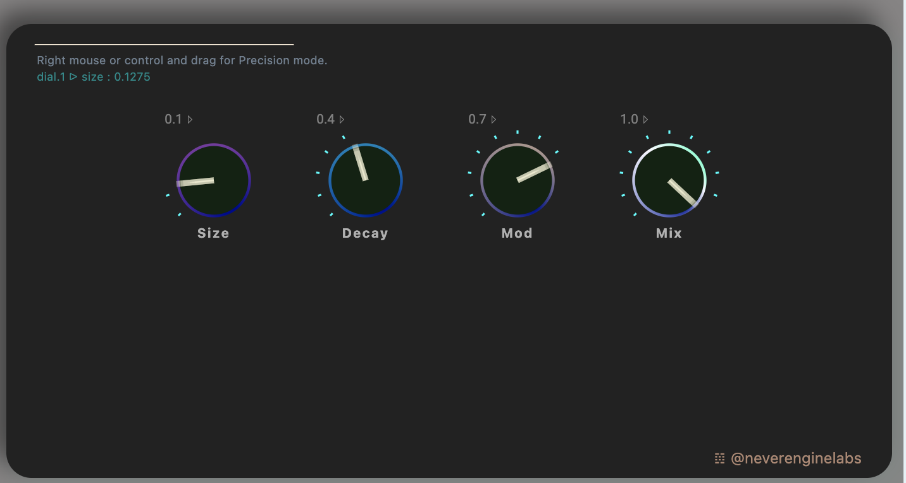

# SRVB
## Audio plugin template with SvelteKit, Typescript, Skeleton and Elementary.Audio

* MIT Licensed ⤵︎
* ▷ [Elementary](https://github.com/elemaudio/elementary)  
* ▷ [SvelteKit](https://github.com/sveltejs/svelte)
* ▷ [SkeletonUI](https://www.skeleton.dev/)

This is a template for building audio plugins with Elementary, SvelteKit, Tailwind (via SkeletonUI). The native plugins have a front end running in ...
>**..the world's most hassle-free single-header WebView class!**

..thanks to the brilliant audio OSS team behind [CHOC](https://github.com/Tracktion/choc) and JUCE. Which, combined with SvelteKit compiled JS, makes for a very fast, stateful front-end. 

Ok. First off. I won't pretend that building native plug-ins is not rocket science. _It is._

>**Open the pod bay doors HAL.**

Let's start with what this codebase is. It is a template you can use to roll your own plugins with the above stack. It was forked from the milestone that is [SRVB](https://github.com/elemaudio/srvb) , a realworld build example shared by Elementary Audio, which uses React and Tailwind for the front-end and state.  The audio [DSP algorithm](https://github.com/elemaudio/srvb/blob/main/dsp/srvb.js) involved by default is an Elementary implementation of the excellent sounding [SignalSmith Hadamard Matrix reverberator](https://github.com/Signalsmith-Audio/reverb-example-code) (which definitely deserves to be the new FreeVerb, it's super lush). I went about replacing React with SvelteKit and Tailwind with Skeleton UI which is a nice Svelte-y Tailwind based UI library, with loads of webdesign features. Probably a lot more than you would ever need in a plugin. I also contributed the radial dial component to this version of the plugin, taken from my own funky Svelte component pack ▷ [PrecisUI](https://github.com/cristianvogel/Precis-UI) .



The Elementary team have automated the native build process a lot. To accomplish this, the original template uses subtly complex `git submodules` technology. If you haven't worked with a `git submodule` before, ok. Open [this chapter](https://git-scm.com/book/en/v2/Git-Tools-Submodules) in a tab. Notice this bit -
> When you clone such a project, by default you get the directories that contain submodules, but none of the files within them yet.

Basically, nothing will work until all the submodules and their deps are downloaded. That's a lot of stuff for this scripted build repo; namely JUCE, Elementary, CHOC. You want to see a folder called `native` being populated on your local machine, with the contents of these libraries, being checked out from a precise commit ID. You may run into build problems, if the latest version of JUCE is pulled, so be aware that the commit ID's are the correct ones. I have seen this working all the way to finished artifacts with;

* `juce @ 69795dcz`
* `elementary @ c16e089`
* `choc @ de61da5`

I have found that after making a new repository from the template (this or the original at [Elementary](), you still need to manually clone the submodules.

```
git clone --recursive <repository>
```

For example, if you are using this here template - the SvelteKit fork - replace `<repository>` with `https://github.com/cristianvogel/srvb-plugin-svelte`

To go all the way into a native build, will involve installing the CMake dependency and running the CMake scripts that Nick and collaborators have kindly setup. They do work fine, at the time of writing this. Read the original guide attached below.

Running `npm run dev` will script the full native dev environment which impressively allows hot-swap _jit_  developing updating changes to the plugin running natively inside a DAW host ( 😎 !)

Building that environment can take a while and be frustrating if there are bugs, so I added a `npm run dev-ui` option to run dev the UI part in a localhost browser page and iterate on that rapidly. Obviously no native binding will happen there. 

Also, I needed to adjust the `CMakeLists.txt` flow to accomodate compiling a SvelteKit app first and then moving it into the native build assets scope. 

_Buena suerte!_

---

_What follows here is the original ReadMe from SRVB repo_

 **DEFINITELY READ ⤵︎**

SRVB is a small digital reverb audio plugin (VST3/AU) for MacOS and Windows.

This project demonstrates one way to write an audio plugin using JavaScript and
familiar web technologies, and while there are several variants on this approach,
it is meant to be both a compelling example and a good starting point for audio
plugins made with a similar architecture.

## Overview

The software architecture in this plugin is much like [Tauri](https://tauri.app/) and similar to
[Electron](https://www.electronjs.org/). The user interface is a simple Vite, React, and Tailwind app
at the root of the repository, which is packaged into the plugin app bundle and loaded into a native
webview instance owned by the plugin at runtime.

The audio processing algorithm in the `dsp/` directory is also written in
JavaScript using [Elementary](https://elementary.audio), and is run in a separate
engine which directs the underlying native plugin audio processing. The native
plugin itself provides the harness for these two frontend JavaScript bundles,
and interfaces with the plugin host (typically a DAW) to coordinate the user
interface and the audio processing loop.

## Elementary

If you're new to Elementary Audio, [Elementary](https://elementary.audio) is a JavaScript/C++ library for building audio applications.

* **Declarative:** Elementary makes it simple to create interactive audio processes through functional, declarative programming. Describe your audio process as a function of your application state, and Elementary will efficiently update the underlying audio engine as necessary.
* **Dynamic:** Most audio processing frameworks and tools facilitate building static processes. But what happens as your audio requirements change throughout the user journey? Elementary is designed to facilitate and adapt to the dynamic nature of modern audio applications.
* **Portable:** By decoupling the JavaScript API from the underlying audio engine (the "what" from the "how"), Elementary enables writing portable applications. Whether the underlying engine is running in the browser, an audio plugin, or an embedded device, the JavaScript layer remains the same.

Find more in the [Elementary repository on GitHub](https://github.com/elemaudio/elementary) and the documentation [on the website](https://elementary.audio/).

## Getting Started

### Dependencies

Before running the following steps, please make sure you have the following dependencies installed and
available at the command line:

* [CMake](https://cmake.org/)
* [Node.js](https://nodejs.org/en)
* Bash: the build steps below expect to run scripts in a Bash environment. For Windows machines, consider running the following steps in a Git Bash environment, or with WSL.

Next, we fetch the SRVB project and its dependencies,

```bash
# Clone the project with its submodules
git clone --recurse-submodules https://github.com/elemaudio/srvb.git
cd srvb

# Install npm dependencies
npm install
```

### Develop

```bash
npm run dev
```

In develop mode, the native plugin is compiled to fetch its JavaScript assets from localhost, where subsequently we
run the Vite dev server to serve those assets. This arrangement enables Vite's hot reloading behavior for developing
the plugin while it's running inside a host.

### Release

```bash
npm run build
```

In release builds, the JavaScript bundles are packaged into the plugin app bundle so that the resulting bundle
is relocatable, thereby enabling distribution to end users.

### Troubleshooting

* After a successful build with either `npm run dev` or `npm run build`, you
  should have local plugin binaries built and copied into the correct
  audio plugin directories on your machine. If you don't see them, look in
  `./native/build/scripted/SRVB_artefacts` and copy them manually
* **Note**: the CMake build on Windows attempts to copy the VST3 plugin binary
  into `C:\Program Files`, a step that requires admin permissions. Therefore
  you should either run your build as an admin, or disable the copy plugin step
  in `native/CMakeLists.txt` and manually copy the plugin binary after build.
* **Note**: especially on MacOS, certain plugin hosts such as Ableton Live have
  strict security settings that prevent them from recognizing local unsigned
  binaries. You'll want to either add a codesign step to your build, or
  configure the security settings of your host to address this.

## License

[MIT](./LICENSE.md)

This project also uses [JUCE](https://juce.com/), which is licensed GPLv3. Please consult JUCE's license
agreement if you intend to distribute your own plugin based on this template.
